Tidyverse Essentials
================
Kaymal

  - [Data Wrangling with `dplyr`](#data-wrangling-with-dplyr)
      - [The `filter` Verb](#the-filter-verb)
      - [The `arrange` Verb](#the-arrange-verb)
      - [The `select` Verb](#the-select-verb)
      - [The `mutate` Verb](#the-mutate-verb)
      - [The `summarize` Verb](#the-summarize-verb)
      - [Grouping Data with
        `group_by`Verb](#grouping-data-with-group_byverb)
  - [Visualization with `ggplot2`](#visualization-with-ggplot2)
      - [Log Transformation](#log-transformation)
      - [The `color` and the `size`
        Aesthetics](#the-color-and-the-size-aesthetics)
      - [Faceting](#faceting)
      - [Visualizing Summarized Data](#visualizing-summarized-data)
      - [Line Plot](#line-plot)
      - [Bar Plot](#bar-plot)
      - [Histograms](#histograms)
      - [Boxplots](#boxplots)

  - Data Wrangling/Transformation with `dplyr`
  - Data Visualization with `ggplot2`

<!-- end list -->

``` r
# Load the necessary packages
library(gapminder)
library(dplyr)
```

    ## 
    ## Attaching package: 'dplyr'

    ## The following objects are masked from 'package:stats':
    ## 
    ##     filter, lag

    ## The following objects are masked from 'package:base':
    ## 
    ##     intersect, setdiff, setequal, union

``` r
# vignette("dplyr")
```

``` r
# Print the head of the  gapminder dataset
head(gapminder, n = 3)
```

    ## # A tibble: 3 x 6
    ##   country     continent  year lifeExp      pop gdpPercap
    ##   <fct>       <fct>     <int>   <dbl>    <int>     <dbl>
    ## 1 Afghanistan Asia       1952    28.8  8425333      779.
    ## 2 Afghanistan Asia       1957    30.3  9240934      821.
    ## 3 Afghanistan Asia       1962    32.0 10267083      853.

``` r
# Print the tail of the  gapminder dataset
tail(gapminder, n = 3)
```

    ## # A tibble: 3 x 6
    ##   country  continent  year lifeExp      pop gdpPercap
    ##   <fct>    <fct>     <int>   <dbl>    <int>     <dbl>
    ## 1 Zimbabwe Africa     1997    46.8 11404948      792.
    ## 2 Zimbabwe Africa     2002    40.0 11926563      672.
    ## 3 Zimbabwe Africa     2007    43.5 12311143      470.

``` r
summary(gapminder)
```

    ##         country        continent        year         lifeExp     
    ##  Afghanistan:  12   Africa  :624   Min.   :1952   Min.   :23.60  
    ##  Albania    :  12   Americas:300   1st Qu.:1966   1st Qu.:48.20  
    ##  Algeria    :  12   Asia    :396   Median :1980   Median :60.71  
    ##  Angola     :  12   Europe  :360   Mean   :1980   Mean   :59.47  
    ##  Argentina  :  12   Oceania : 24   3rd Qu.:1993   3rd Qu.:70.85  
    ##  Australia  :  12                  Max.   :2007   Max.   :82.60  
    ##  (Other)    :1632                                                
    ##       pop              gdpPercap       
    ##  Min.   :6.001e+04   Min.   :   241.2  
    ##  1st Qu.:2.794e+06   1st Qu.:  1202.1  
    ##  Median :7.024e+06   Median :  3531.8  
    ##  Mean   :2.960e+07   Mean   :  7215.3  
    ##  3rd Qu.:1.959e+07   3rd Qu.:  9325.5  
    ##  Max.   :1.319e+09   Max.   :113523.1  
    ## 

## Data Wrangling with `dplyr`

I’ll use `dplyr` to apply transformation such as filtering, sorting, and
summarizing to data. `dplyr` is a grammar of data manipulation,
providing a consistent set of verbs that help you solve the most common
data manipulation challenges:

  - `filter()` picks/selects cases based on their values.
  - `arrange()` changes the ordering of the rows.
  - `mutate()` adds new variables that are functions of existing
    variables.
  - `select()` picks variables based on their names.
  - `summarize()` reduces multiple values down to a single summary.

These all combine naturally with `group_by()` which allows to perform
any operation “by group”.

[dplyr](https://dplyr.tidyverse.org)

### The `filter` Verb

`filter()` allows us to select a subset of rows in a data frame.

``` r
# Filter the gapminder dataset for the country Turkey
gapminder %>%
  filter(country == "Turkey")
```

    ## # A tibble: 12 x 6
    ##    country continent  year lifeExp      pop gdpPercap
    ##    <fct>   <fct>     <int>   <dbl>    <int>     <dbl>
    ##  1 Turkey  Europe     1952    43.6 22235677     1969.
    ##  2 Turkey  Europe     1957    48.1 25670939     2219.
    ##  3 Turkey  Europe     1962    52.1 29788695     2323.
    ##  4 Turkey  Europe     1967    54.3 33411317     2826.
    ##  5 Turkey  Europe     1972    57.0 37492953     3451.
    ##  6 Turkey  Europe     1977    59.5 42404033     4269.
    ##  7 Turkey  Europe     1982    61.0 47328791     4241.
    ##  8 Turkey  Europe     1987    63.1 52881328     5089.
    ##  9 Turkey  Europe     1992    66.1 58179144     5678.
    ## 10 Turkey  Europe     1997    68.8 63047647     6601.
    ## 11 Turkey  Europe     2002    70.8 67308928     6508.
    ## 12 Turkey  Europe     2007    71.8 71158647     8458.

``` r
# Filter for Turkey in 2007
gapminder %>% 
  filter(country == "Turkey", year == 2007)
```

    ## # A tibble: 1 x 6
    ##   country continent  year lifeExp      pop gdpPercap
    ##   <fct>   <fct>     <int>   <dbl>    <int>     <dbl>
    ## 1 Turkey  Europe     2007    71.8 71158647     8458.

### The `arrange` Verb

`arrange()` works similarly to `filter()` except that instead of
filtering or selecting rows, it reorders them.

``` r
# Sort in ascending order of lifeExp
gapminder %>%
  arrange(lifeExp)
```

    ## # A tibble: 1,704 x 6
    ##    country      continent  year lifeExp     pop gdpPercap
    ##    <fct>        <fct>     <int>   <dbl>   <int>     <dbl>
    ##  1 Rwanda       Africa     1992    23.6 7290203      737.
    ##  2 Afghanistan  Asia       1952    28.8 8425333      779.
    ##  3 Gambia       Africa     1952    30    284320      485.
    ##  4 Angola       Africa     1952    30.0 4232095     3521.
    ##  5 Sierra Leone Africa     1952    30.3 2143249      880.
    ##  6 Afghanistan  Asia       1957    30.3 9240934      821.
    ##  7 Cambodia     Asia       1977    31.2 6978607      525.
    ##  8 Mozambique   Africa     1952    31.3 6446316      469.
    ##  9 Sierra Leone Africa     1957    31.6 2295678     1004.
    ## 10 Burkina Faso Africa     1952    32.0 4469979      543.
    ## # … with 1,694 more rows

``` r
# Sort in descending order of lifeExp
gapminder %>% 
  arrange(desc(lifeExp))
```

    ## # A tibble: 1,704 x 6
    ##    country          continent  year lifeExp       pop gdpPercap
    ##    <fct>            <fct>     <int>   <dbl>     <int>     <dbl>
    ##  1 Japan            Asia       2007    82.6 127467972    31656.
    ##  2 Hong Kong, China Asia       2007    82.2   6980412    39725.
    ##  3 Japan            Asia       2002    82   127065841    28605.
    ##  4 Iceland          Europe     2007    81.8    301931    36181.
    ##  5 Switzerland      Europe     2007    81.7   7554661    37506.
    ##  6 Hong Kong, China Asia       2002    81.5   6762476    30209.
    ##  7 Australia        Oceania    2007    81.2  20434176    34435.
    ##  8 Spain            Europe     2007    80.9  40448191    28821.
    ##  9 Sweden           Europe     2007    80.9   9031088    33860.
    ## 10 Israel           Asia       2007    80.7   6426679    25523.
    ## # … with 1,694 more rows

``` r
# Filter for the year 2008, then arrange in descending order of population
gapminder %>%
  filter(year == 2007) %>%
  arrange(desc(pop))
```

    ## # A tibble: 142 x 6
    ##    country       continent  year lifeExp        pop gdpPercap
    ##    <fct>         <fct>     <int>   <dbl>      <int>     <dbl>
    ##  1 China         Asia       2007    73.0 1318683096     4959.
    ##  2 India         Asia       2007    64.7 1110396331     2452.
    ##  3 United States Americas   2007    78.2  301139947    42952.
    ##  4 Indonesia     Asia       2007    70.6  223547000     3541.
    ##  5 Brazil        Americas   2007    72.4  190010647     9066.
    ##  6 Pakistan      Asia       2007    65.5  169270617     2606.
    ##  7 Bangladesh    Asia       2007    64.1  150448339     1391.
    ##  8 Nigeria       Africa     2007    46.9  135031164     2014.
    ##  9 Japan         Asia       2007    82.6  127467972    31656.
    ## 10 Mexico        Americas   2007    76.2  108700891    11978.
    ## # … with 132 more rows

### The `select` Verb

`select()` allows us to rapidly zoom in on a useful subset using
operations that usually only work on numeric variable positions.

``` r
gapminder %>%
  select(country, pop)
```

    ## # A tibble: 1,704 x 2
    ##    country          pop
    ##    <fct>          <int>
    ##  1 Afghanistan  8425333
    ##  2 Afghanistan  9240934
    ##  3 Afghanistan 10267083
    ##  4 Afghanistan 11537966
    ##  5 Afghanistan 13079460
    ##  6 Afghanistan 14880372
    ##  7 Afghanistan 12881816
    ##  8 Afghanistan 13867957
    ##  9 Afghanistan 16317921
    ## 10 Afghanistan 22227415
    ## # … with 1,694 more rows

We can also return a “subset” of columns from a data frame by listing
the name of each column to drop.

``` r
gapminder %>%
  select(-c(continent, pop, gdpPercap))
```

    ## # A tibble: 1,704 x 3
    ##    country      year lifeExp
    ##    <fct>       <int>   <dbl>
    ##  1 Afghanistan  1952    28.8
    ##  2 Afghanistan  1957    30.3
    ##  3 Afghanistan  1962    32.0
    ##  4 Afghanistan  1967    34.0
    ##  5 Afghanistan  1972    36.1
    ##  6 Afghanistan  1977    38.4
    ##  7 Afghanistan  1982    39.9
    ##  8 Afghanistan  1987    40.8
    ##  9 Afghanistan  1992    41.7
    ## 10 Afghanistan  1997    41.8
    ## # … with 1,694 more rows

### The `mutate` Verb

Besides selecting sets of existing columns, it’s often useful to add new
columns/variables that are functions of existing columns.

``` r
# Filter, mutate, and arrange the gapminder dataset
gapminder %>%
  mutate(gdp = gdpPercap * pop) %>% 
  filter(year == 2007) %>%   
  arrange(desc(gdp))
```

    ## # A tibble: 142 x 7
    ##    country        continent  year lifeExp        pop gdpPercap     gdp
    ##    <fct>          <fct>     <int>   <dbl>      <int>     <dbl>   <dbl>
    ##  1 United States  Americas   2007    78.2  301139947    42952. 1.29e13
    ##  2 China          Asia       2007    73.0 1318683096     4959. 6.54e12
    ##  3 Japan          Asia       2007    82.6  127467972    31656. 4.04e12
    ##  4 India          Asia       2007    64.7 1110396331     2452. 2.72e12
    ##  5 Germany        Europe     2007    79.4   82400996    32170. 2.65e12
    ##  6 United Kingdom Europe     2007    79.4   60776238    33203. 2.02e12
    ##  7 France         Europe     2007    80.7   61083916    30470. 1.86e12
    ##  8 Brazil         Americas   2007    72.4  190010647     9066. 1.72e12
    ##  9 Italy          Europe     2007    80.5   58147733    28570. 1.66e12
    ## 10 Mexico         Americas   2007    76.2  108700891    11978. 1.30e12
    ## # … with 132 more rows

### The `summarize` Verb

`summarize` helps us compute summary statistics for the data (e.g
`sum()`, `max()`, `mean()`).

``` r
# Summarize to find the mean life expectancy
gapminder %>%
  summarize(meanLifeExp = mean(lifeExp))
```

    ## # A tibble: 1 x 1
    ##   meanLifeExp
    ##         <dbl>
    ## 1        59.5

``` r
# Filter for 2007 then summarize the mean and median life expectancy
gapminder %>%
  filter(year == 2007) %>%
  summarize(meanLifeExp = mean(lifeExp),
            medianLifeExp = median(lifeExp))
```

    ## # A tibble: 1 x 2
    ##   meanLifeExp medianLifeExp
    ##         <dbl>         <dbl>
    ## 1        67.0          71.9

### Grouping Data with `group_by`Verb

``` r
# Find the mean life expectancy and total population in each year
gapminder %>%
  group_by(year) %>%
  summarize(meanLifeExp = mean(lifeExp),
            totalPop = sum(as.numeric(pop)))
```

    ## # A tibble: 12 x 3
    ##     year meanLifeExp   totalPop
    ##    <int>       <dbl>      <dbl>
    ##  1  1952        49.1 2406957150
    ##  2  1957        51.5 2664404580
    ##  3  1962        53.6 2899782974
    ##  4  1967        55.7 3217478384
    ##  5  1972        57.6 3576977158
    ##  6  1977        59.6 3930045807
    ##  7  1982        61.5 4289436840
    ##  8  1987        63.2 4691477418
    ##  9  1992        64.2 5110710260
    ## 10  1997        65.0 5515204472
    ## 11  2002        65.7 5886977579
    ## 12  2007        67.0 6251013179

Both mean and median life expectancy are going up over time.

``` r
# Find mean and median life expectancy in each year/continent combination
gapminder %>%
  group_by(year, continent) %>%
  summarize(meanLifeExp = mean(lifeExp),
            medianLifeExp = median(lifeExp))
```

    ## # A tibble: 60 x 4
    ## # Groups:   year [12]
    ##     year continent meanLifeExp medianLifeExp
    ##    <int> <fct>           <dbl>         <dbl>
    ##  1  1952 Africa           39.1          38.8
    ##  2  1952 Americas         53.3          54.7
    ##  3  1952 Asia             46.3          44.9
    ##  4  1952 Europe           64.4          65.9
    ##  5  1952 Oceania          69.3          69.3
    ##  6  1957 Africa           41.3          40.6
    ##  7  1957 Americas         56.0          56.1
    ##  8  1957 Asia             49.3          48.3
    ##  9  1957 Europe           66.7          67.6
    ## 10  1957 Oceania          70.3          70.3
    ## # … with 50 more rows

## Visualization with `ggplot2`

`ggplot2` is a system for ‘declaratively’ creating graphics, based on
“The Grammar of Graphics”.

``` r
library(ggplot2)
```

``` r
# Create gapminder_2007
gapminder_2007 <- gapminder %>%
  filter(year == 2007)
```

``` r
# Plot gdpPercap vs lifeExp for the year 2007
ggplot(gapminder_2007, aes(x = gdpPercap, y = lifeExp)) +
  geom_point()
```

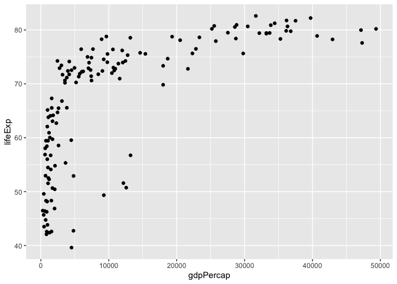<!-- -->

The problem with this plot is that, most of the countries are in the
leftmost part of the x-axis. Let’s plot the graph with population on log
scale.

### Log Transformation

``` r
# Plot log transformed gdpPercap vs lifeExp for the year 2007
ggplot(gapminder_2007, aes(x = gdpPercap, y = lifeExp)) +
  geom_point() +
  scale_x_log10()
```

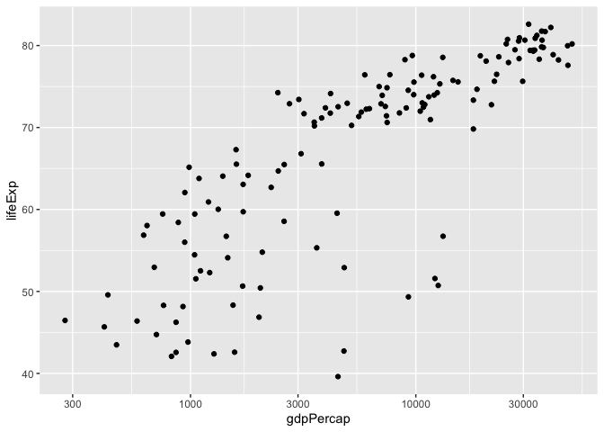<!-- -->

The relationship between GDP per capita and life expetancy looks more
**linear** on this scale. Additionally, it is now easier to distinguish
the countries at the lower end of the spectrum.

``` r
# Plot histogram of gdpPercap
ggplot(gapminder_2007, aes(x = gdpPercap)) +
  geom_histogram(bins = 10)
```

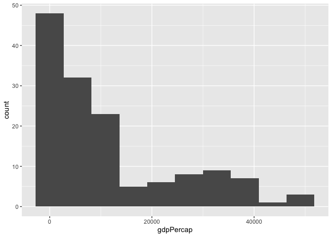<!-- -->

``` r
# Plot histogram of log(gdpPercap)
ggplot(gapminder_2007, aes(x = gdpPercap)) +
  geom_histogram(bins = 10) +
  scale_x_log10()
```

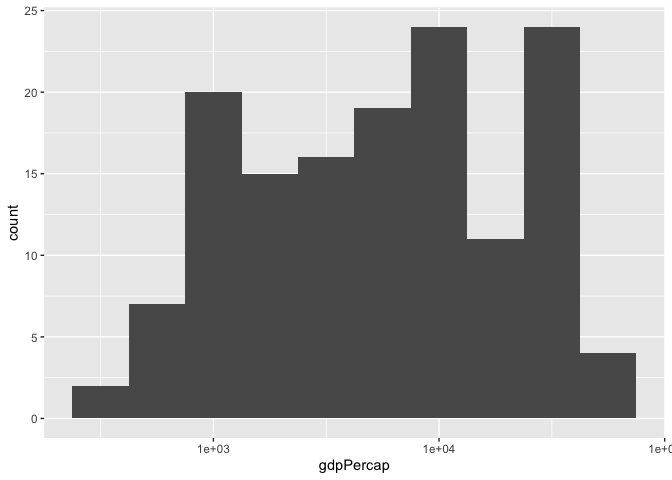<!-- -->

On a log scale, the distribution of `gdpPercap` is approximately
symmetrical.

``` r
# Plot pop vs lifeExp
ggplot(gapminder_2007, aes(x = pop, y = lifeExp)) +
  geom_point() 
```

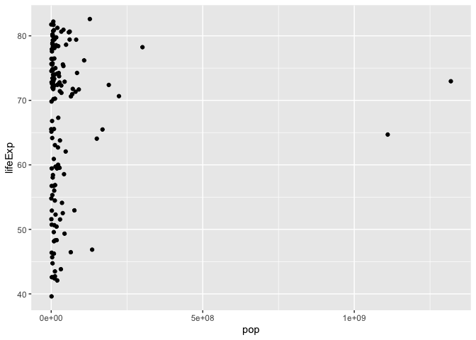<!-- -->

It is a good idea to put the x-axis on a log scale to better undrestand
the relationship between population and the life expectancy.

``` r
# Plot pop vs lifeExp with the x-axis on a log scale
ggplot(gapminder_2007, aes(x = pop, y = lifeExp)) +
  geom_point() +
  scale_x_log10()
```

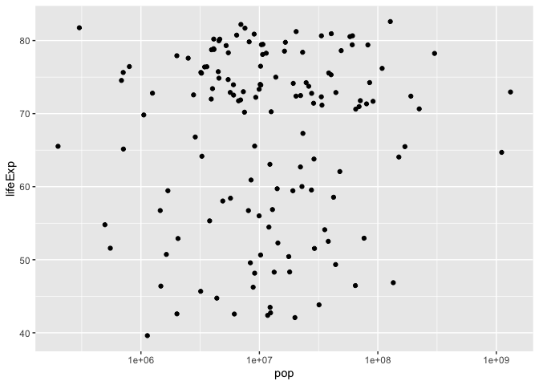<!-- -->

The points appear to be spread out on the x-axis after the log
transformation. This makes it easy to see that there isn’t a correlation
between `population` and life `expectancy`.

### The `color` and the `size` Aesthetics

``` r
# Scatter plot comparing gdpPercap and lifeExp, with color representing continent
ggplot(gapminder_2007, aes(x = gdpPercap, y = lifeExp, color=continent)) +
  geom_point() +
  scale_x_log10()
```

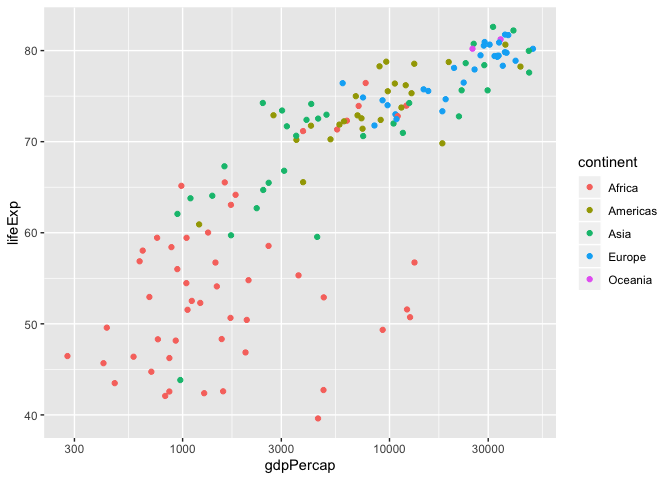<!-- -->

This plot communicates a lot about differences in GDP and life
expectancy among continents. For instance, the average life expectancy
(and the GDP per capita to some extend) tends to be lowest for African
countries.

We can also represent the `population` of the countries with `size`
aesthetic.

``` r
# Scatter plot comparing gdpPercap and lifeExp, with color representing continent
# Add the size aesthetic to represent a country's gdpPercap
ggplot(gapminder_2007, aes(x = gdpPercap, y = lifeExp, color=continent, size=pop, alpha=.5)) +
  geom_point() +
  scale_x_log10()
```

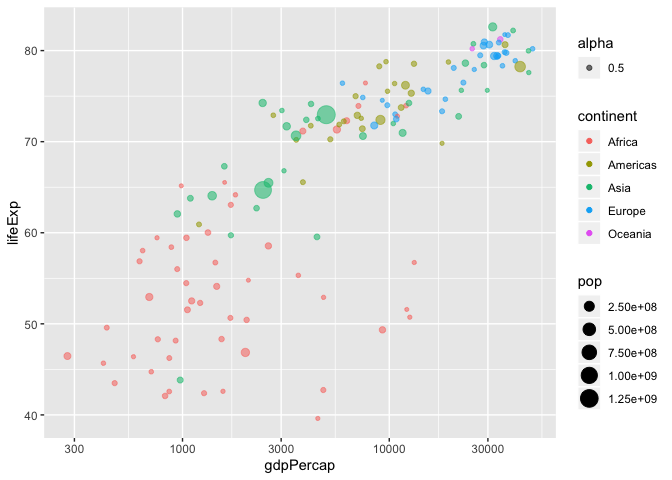<!-- -->

### Faceting

``` r
# Scatter plot comparing gdpPercap and lifeExp, faceted by continent
ggplot(gapminder_2007, aes(x = gdpPercap, y = lifeExp, color = continent, size = pop)) +
  geom_point(alpha=0.5) +
  scale_x_log10() +
  facet_wrap(~ continent)
```

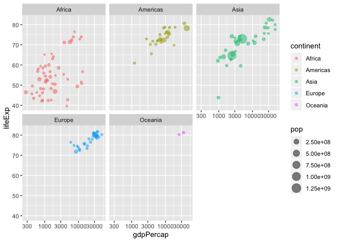<!-- -->

### Visualizing Summarized Data

``` r
# Summarize data within each year within each continent
by_year_continent <-  gapminder %>%
  group_by(year, continent) %>%
  summarize(meanLifeExp = mean(lifeExp),
            totalPop = sum(as.numeric(pop)))

# Plot the change in totalPop in each continent over time
ggplot(by_year_continent, aes(x = year, y = totalPop, color = continent)) +
  geom_point() +
  expand_limits(y = 0)
```

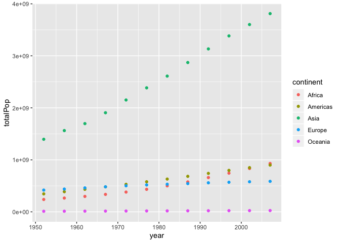<!-- -->

It looks like mean population across all continents (except Oceanica) is
increasing over time.

``` r
# Summarize the median GDP and median life expectancy per continent in 2007
by_continent_2007 <- gapminder %>%
  filter(year == 2007) %>%
  group_by(continent) %>%
  summarize(medianLifeExp = median(lifeExp),
    medianGdpPercap = median(gdpPercap))

# Use a scatter plot to compare the median GDP and median life expectancy
ggplot(by_continent_2007, aes(x = medianGdpPercap, y = medianLifeExp, color = continent)) +
  geom_point() +
  expand_limits(y = 0)
```

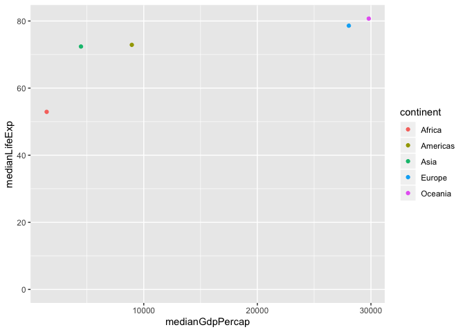<!-- -->

### Line Plot

``` r
# Summarize the median gdpPercap by year, then save it as by_year
by_year <- gapminder %>%
  group_by(year) %>%
  summarize(medianGdpPercap = median(gdpPercap))

# Create a line plot showing the change in medianGdpPercap over time
ggplot(by_year, aes(x = year, y = medianGdpPercap)) +
  geom_line() +
  expand_limits(y = 0) +
  labs(title = "Change in Median GDP per Capita")
```

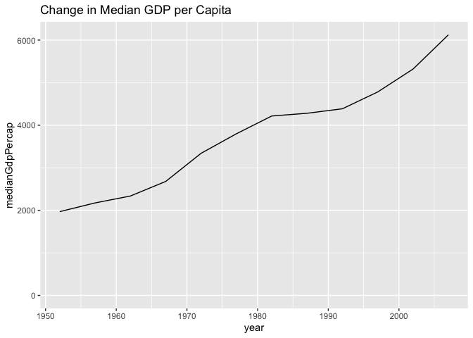<!-- -->

Median GDP per capita across countries has gone up over time. However
the graph below shows that the growth in median GDP per capita differ
between continents.

``` r
# Summarize the median gdpPercap by year & continent, save as by_year_continent
by_year_continent <- gapminder %>%
  group_by(year, continent) %>%
  summarize(medianGdpPercap = median(gdpPercap))

# Create a line plot showing the change in medianGdpPercap by continent over time
ggplot(by_year_continent, aes(x = year, y = medianGdpPercap, color = continent)) +
  geom_line() +
  expand_limits(y = 0) 
```

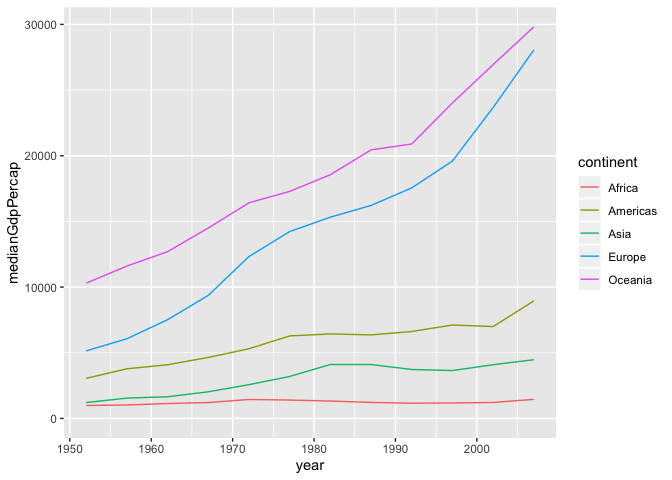<!-- -->

### Bar Plot

``` r
# Summarize the median gdpPercap by year and continent in 2007
by_continent <- gapminder %>%
  filter(year == 2007) %>%
  group_by(continent) %>%
  summarize(medianGdpPercap = median(gdpPercap))


# Create a bar plot showing medianGdp by continent
ggplot(by_continent, aes(x = continent, y = medianGdpPercap, color = continent)) +
  geom_col()
```

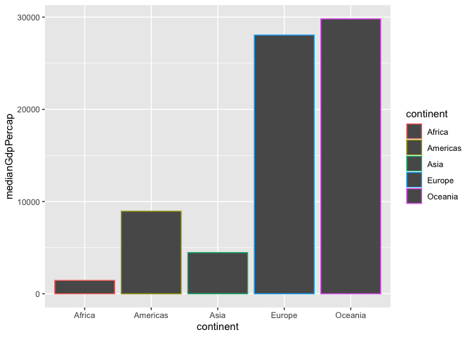<!-- -->

``` r
# Filter for observations in the Europe continent in 2007
europe_2007 <- gapminder %>%
  filter(year == 2007, continent == "Europe")
  
# Create a bar plot of gdpPercap by country
ggplot(europe_2007, aes(reorder(country, gdpPercap), gdpPercap)) +
  geom_col() + 
  coord_flip() + # horizontal bar plot
  ggtitle("Bar Plot of gdpPercap by Country in Europe in 2007")
```

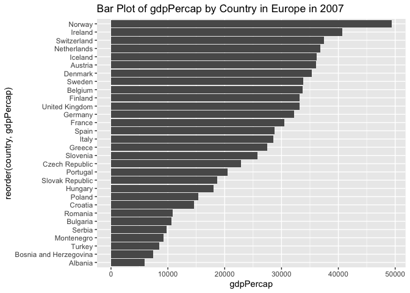<!-- -->

### Histograms

``` r
# Plot histogram of lifeExp
ggplot(gapminder_2007, aes(x = lifeExp)) +
  geom_histogram(binwidth = 5)
```

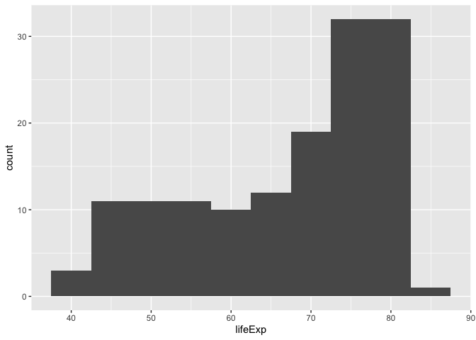<!-- -->

### Boxplots

``` r
# Create a boxplot comparing lifeExp among continents
ggplot(gapminder_2007, aes(continent, lifeExp)) +
  geom_boxplot()
```

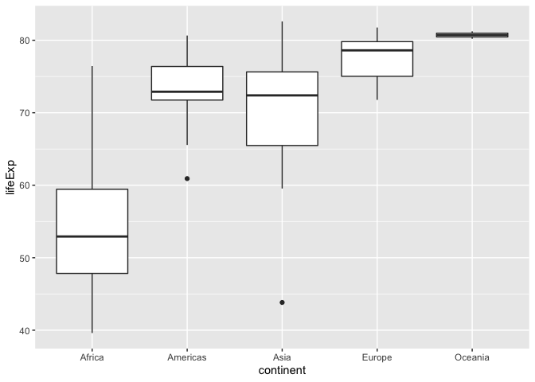<!-- -->
